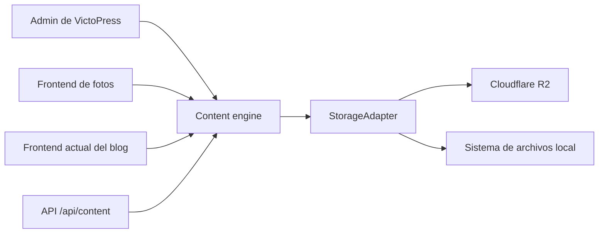
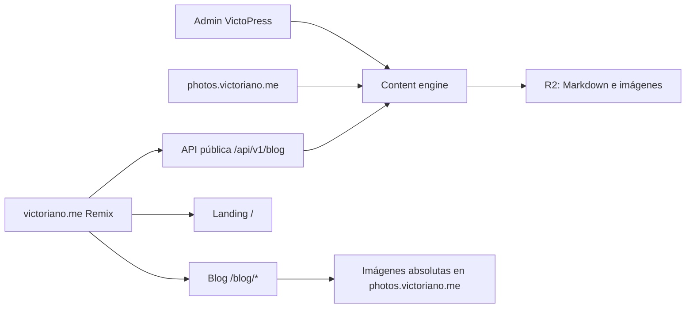

# VictoPress headless para victoriano.me/blog

Actualizado el 22 de julio de 2026 en la rama **codex/headless-blog**.

## Decisión

VictoPress sigue siendo el único CMS y la fuente de verdad del blog. La web
personal es una aplicación Remix independiente que publica el contenido en
**victoriano.me/blog** mediante una API HTTP de solo lectura.

- VictoPress conserva Markdown, frontmatter, borradores, imágenes y R2.
- El frontend personal no conoce R2 ni importa código interno del CMS.
- photos.victoriano.me puede mantener un frontend fotográfico distinto.
- Un artículo se edita una sola vez en VictoPress.

## Estado implementado

La frontera headless ya existe:

- **GET /api/v1/blog** lista únicamente artículos publicados.
- **GET /api/v1/blog/*** resuelve slugs históricos anidados.
- Los borradores y las rutas inexistentes devuelven 404.
- El listado no incluye cuerpos completos.
- El detalle incluye Markdown original, HTML sanitizado y navegación
  anterior/siguiente.
- Portadas, imágenes y enlaces internos heredados salen como URLs absolutas del
  frontend de VictoPress.
- Las respuestas incluyen versión de API, CORS, ETag y política de caché.
- El sitemap de VictoPress omite el blog cuando su URL pública pertenece a otro
  origen.
- Los enlaces “View” del editor apuntan a la URL pública externa.
- El contrato acepta `locale=es|en` y expone idioma solicitado, resuelto,
  ediciones disponibles, fallback explícito y URLs alternas.

La aplicación independiente de **/Users/victoriano/Code/victoriano.me** consume
este contrato desde loaders de servidor. Ya ofrece archivo, detalle, RSS,
sitemap, metadatos sociales, JSON-LD y diseño responsive.

## Contrato

El índice expone:

- apiVersion
- site.name y site.blogUrl
- count
- posts con slug, título, fecha, extracto, tiempo de lectura, etiquetas,
  portada y URL canónica

El detalle añade:

- author y sourceUrl
- format y contentMarkdown
- contentHtml sanitizado
- images absolutas
- navigation.newer y navigation.older

Los clientes deben validar que **apiVersion** sea **1** antes de renderizar.

## Configuración

Variables de VictoPress:

- **BLOG_SITE_NAME**: nombre público del autor o sitio.
- **PUBLIC_BLOG_URL**: origen y prefijo del frontend, por ejemplo
  https://victoriano.me/blog.
- **PUBLIC_MEDIA_URL**: origen público de VictoPress, por ejemplo
  https://photos.victoriano.me.

Variable del frontend personal:

- **VICTOPRESS_API_URL**: endpoint base, por ejemplo
  https://photos.victoriano.me/api/v1/blog.

## Flujo editorial comprobado

1. El editor crea una entrada. VictoPress la guarda como borrador.
2. La API pública responde 404 mientras draft sea verdadero.
3. Al publicar, el slug permanece estable aunque cambie el título.
4. La API devuelve el artículo y el frontend independiente lo renderiza.
5. Al borrarlo, desaparece del índice, del detalle y del frontend.

La prueba end-to-end se ejecutó con una entrada temporal y terminó eliminando
el archivo y reconstruyendo el índice. El inventario volvió a cinco posts.

## Seguridad y compatibilidad

- El HTML crudo pegado en Markdown se escapa y no puede ejecutar scripts.
- Los protocolos de enlace e imagen no seguros se descartan.
- Los slugs con traversal, barras codificadas o encoding inválido se rechazan.
- Las imágenes siguen pasando por la ruta optimizada de VictoPress.
- El renderer normal de VictoPress conserva URLs relativas; solo el contrato
  headless las convierte a absolutas.

## Migración al dominio definitivo

Antes de mover producción:

1. Desplegar esta rama con el contenido y secretos actuales de VictoPress.
2. Publicar el repositorio personal en victoriano.me.
3. Establecer PUBLIC_MEDIA_URL en https://photos.victoriano.me.
4. Establecer PUBLIC_BLOG_URL en https://victoriano.me/blog.
5. Cambiar VICTOPRESS_API_URL a
   https://photos.victoriano.me/api/v1/blog.
6. Validar los cinco slugs, las 24 imágenes, RSS, sitemap y canónicas.
7. Activar redirecciones 301 desde cualquier URL antigua del blog.
8. Permitir indexación en robots.txt del frontend personal.

No hace falta dar acceso a R2 al repositorio personal.

## Previews de esta rama

- CMS y API: https://victopress-headless.nominao.com
- Blog independiente: https://victoriano.nominao.com/blog

Ambos previews usan servicios persistentes locales y named tunnels de
Cloudflare; no son todavía los dominios de producción.

La arquitectura bilingüe completa está documentada en
[Spanish and English editions](multilingual-content.md).

---

## Apéndice: auditoría arquitectónica previa

Fecha del análisis: 21 de julio de 2026.

## Decisión recomendada

Mantener una sola instalación de VictoPress como CMS y origen del contenido, pero publicar el blog con un frontend distinto dentro de `victoriano.me/blog`.

- `photos.victoriano.me` seguirá usando el frontend fotográfico de VictoPress.
- `victoriano.me` será una aplicación Remix independiente para la página personal.
- `victoriano.me/blog` será una sección de esa misma aplicación y consumirá una API de lectura de VictoPress.
- Markdown, imágenes, borradores y edición seguirán administrándose únicamente en VictoPress.
- El nuevo repositorio no necesitará R2: solamente renderizará contenido y enlazará imágenes absolutas servidas por VictoPress.

La separación debería hacerse mediante una API pública pequeña y versionada, no reutilizando `/api/content` como contrato permanente.

## Cómo funciona hoy

VictoPress es actualmente un monolito modular. La capa de almacenamiento está bien desacoplada, pero la entrega pública del blog todavía está acoplada a la misma aplicación Remix.



### Lo que ya está desacoplado

La interfaz `StorageAdapter` separa el motor de contenido del proveedor de almacenamiento. Expone operaciones de listado, lectura, escritura, borrado y movimiento. Existen adaptadores para R2, la API de R2, archivos locales y contenido incluido en el bundle.

El modelo editorial también está separado de la UI:

- `scanBlog()` recorre `blog/` en el almacenamiento, lee Markdown y frontmatter con `gray-matter`, calcula extracto y tiempo de lectura, y construye objetos `BlogPost`.
- El escaneo es recursivo y conserva slugs históricos como `2021/10/3/nombre-del-post`.
- Los borradores ya se distinguen con `draft` y pueden excluirse de la publicación.
- El panel de administración escribe cada entrada como `blog/<slug>/index.md` y actualiza el índice de contenido.

Esto permite que VictoPress siga siendo el lugar único para editar y almacenar el blog.

### Lo que aún está acoplado

Los loaders de `/blog` y `/blog/:slug` no consumen una API: importan directamente `getStorage()`, `scanBlog()` y `getPostBySlug()` dentro de la misma aplicación Remix. También cargan navegación y componentes propios de la galería.

Hay otros acoplamientos relevantes:

- El renderizador de Markdown transforma imágenes relativas en URLs del mismo origen bajo `/api/images/...`.
- La portada de cada post también se construye con `/api/images/...`.
- La URL canónica se deriva del host de la petición actual.
- Los enlaces “ver post” del panel de administración apuntan a `/blog/...` en la propia aplicación.
- El sitemap de VictoPress incluye actualmente las URLs del blog.
- `/api/content` genera de una vez galerías, posts, tags y estadísticas. Incluye cuerpos completos y no tiene versión de contrato; es demasiado amplio para convertirlo en la frontera estable entre dos aplicaciones.

Por tanto, hoy se puede crear otro frontend, pero tendría que duplicar lógica interna o depender de una API demasiado genérica. El sistema está cerca de ser headless, no completamente preparado como producto headless.

## Arquitectura objetivo



La aplicación personal no conocerá R2, las rutas internas del CMS ni el `StorageAdapter`. Su único contrato será HTTP.

### API mínima de lectura

Crear estos endpoints públicos en VictoPress:

1. `GET /api/v1/blog`
   - Solo posts publicados.
   - Ordenados por fecha descendente.
   - Campos de listado: `slug`, `title`, `date`, `excerpt`, `readingTime`, `tags`, `coverUrl` y `canonicalUrl`.
   - Sin cuerpo completo para mantener la respuesta ligera.

2. `GET /api/v1/blog/:slug`
   - Acepta slugs anidados.
   - Devuelve `404` para borradores o entradas inexistentes.
   - Campos de detalle: los anteriores, `contentMarkdown`, `contentHtml`, `author`, `sourceUrl` e imágenes con URLs absolutas.

El contrato debería incluir una versión explícita, validarse con tipos compartidos o un esquema y usar `ETag` más cabeceras de caché. No conviene exponer el índice interno completo.

### Resolución de imágenes

La API debe devolver URLs absolutas, por ejemplo:

```text
https://photos.victoriano.me/api/images/blog/2021/10/3/post/foto.jpg
```

Así el frontend personal no necesita credenciales ni acceso directo a R2. VictoPress conserva la responsabilidad de servir, cachear y transformar las imágenes.

El renderizado puede resolverse de dos maneras:

- Preferida inicialmente: VictoPress devuelve `contentHtml` sanitizado y con URLs absolutas. Garantiza que la vista pública y la previsualización del editor usen exactamente el mismo Markdown.
- Alternativa futura: devolver solo Markdown y publicar el renderizador como paquete compartido. Da más control al frontend, pero introduce otra versión que mantener.

## Enrutado, SEO y migración

Cuando el nuevo blog esté listo:

- `victoriano.me/blog` y `victoriano.me/blog/*` serán propiedad del nuevo frontend.
- `photos.victoriano.me/blog/*` redirigirá con `301` a la misma ruta bajo `victoriano.me`.
- VictoPress dejará de incluir entradas de blog en su sitemap público de fotos.
- El sitemap de `victoriano.me` incluirá la landing y todos los posts.
- Las canónicas que entregue la API apuntarán a `https://victoriano.me/blog/...`, no al host del CMS.
- El frontend nuevo tendrá una ruta comodín para conservar los slugs históricos anidados.
- El panel de VictoPress usará una variable como `PUBLIC_BLOG_URL=https://victoriano.me/blog` para construir los enlaces de previsualización.

## Cambios propuestos en VictoPress

1. Extraer un DTO público de blog que no exponga estructuras internas.
2. Añadir `/api/v1/blog` y una ruta comodín `/api/v1/blog/*`.
3. Centralizar la conversión de rutas de imagen en una función que pueda producir URLs absolutas.
4. Añadir `PUBLIC_BLOG_URL` y `PUBLIC_MEDIA_URL` a la configuración.
5. Separar las entradas de blog del sitemap de fotografías cuando se active el frontend externo.
6. Añadir pruebas de contrato para listado, detalle, borradores, slugs anidados, HTML seguro y URLs de imágenes.
7. Después de validar el nuevo frontend, configurar las redirecciones permanentes.

## Riesgos detectados en el checkout actual

Este análisis corresponde a la rama `codex/migrate-squarespace-blog`, que contiene cambios locales sin integrar; no debe asumirse que sea idéntica a producción.

Además, `api.admin.blog.ts` llama actualmente a `storage.createDir()` y `storage.deleteDir()`, pero `StorageAdapter` no declara esos métodos. La interfaz ofrece `deleteDirectory()` y las escrituras a R2 no requieren crear carpetas reales. Ese desfase debe corregirse y cubrirse con una prueba antes de considerar estable el CRUD del blog.

## Plan de entrega

### Fase 1 — Contrato headless

- Implementar y probar la API versionada en VictoPress.
- Medir respuesta, caché y comportamiento ante errores.
- Confirmar que no se filtran borradores ni datos privados.

### Fase 2 — Frontend independiente

- Añadir las rutas `/blog` y `/blog/*` al repositorio de `victoriano.me`.
- Consumir la API desde loaders de servidor Remix.
- Aplicar un diseño editorial propio, compartiendo tipografía y escala con el frontend fotográfico.

### Fase 3 — Cambio de dominio

- Publicar el frontend definitivo.
- Transferir sitemap y canónicas.
- Activar redirecciones `301` desde el dominio de fotos.
- Validar enlaces, imágenes, metadatos sociales y todos los slugs migrados.

## Criterio de éxito

La separación estará completa cuando sea posible rediseñar o desplegar `victoriano.me` sin modificar la UI fotográfica, y actualizar VictoPress sin cambiar el contrato que consume el blog. El contenido seguirá editándose una sola vez en VictoPress y aparecerá en `victoriano.me/blog` con sus imágenes, rutas históricas, SEO y borradores correctamente aislados.
